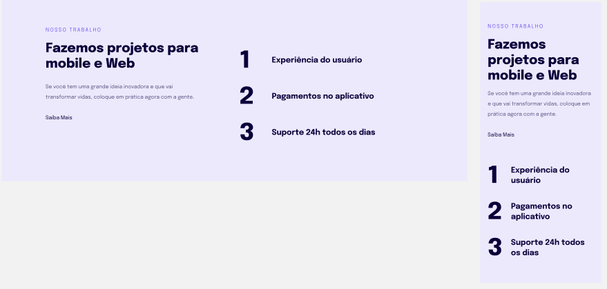

<h1 align="center"> Website Responsive </h1>

Projeto do treinamento da Rocketseat para ensino de tecnologias WEB.

  <a href="#-tecnologias">Tecnologias</a>&nbsp;&nbsp;&nbsp;|&nbsp;&nbsp;&nbsp;
  <a href="#-projeto">Projeto</a>&nbsp;&nbsp;&nbsp;|&nbsp;&nbsp;&nbsp;
  <a href="#-layout">Layout</a>&nbsp;&nbsp;&nbsp;|&nbsp;&nbsp;&nbsp;
  <a href="#memo-licença">Licença</a>

  

 

  

## 🚀 Tecnologias

Esse projeto foi desenvolvido com as seguintes tecnologias:

- HTML e CSS
- Git e Github
- Figma

## 💻 Projeto

O projeto é uma página de estudo sobre responsividade

## 🔖 Layout

Você pode visualizar o layout do projeto através [DESSE LINK](https://www.figma.com/file/Wz394KilwW1ybMXktqu4ec/Explorer-Stage-03-Projeto-02-(Copy)?type=design&node-id=203-412&mode=design&t=BFOFoe51xOuYdebh-0). É necessário ter conta no [Figma](https://figma.com) para acessá-lo.

## :memo: Licença
